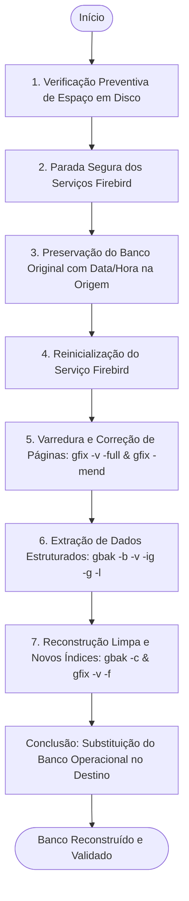

# 🛠️ Recuperador de Banco de Dados Firebird (RecupBD)

<p align="center">
  
</p>

<p align="center">
  <b>Solução desktop em C# / .NET com interface Dark Theme desenvolvida para diagnóstico, reparo físico de corrupções de páginas e reconstrução lógica de bases relacionais Firebird (.IB / .FDB / .GDB).</b>
</p>

<p align="center">
  <a href="https://microsoft.com/windows"></a>
  <a href="https://dotnet.microsoft.com/"></a>
  <a href="https://firebirdsql.org/"></a>
  <a href="https://github.com/jhoneandrade/recup-firebird/releases/latest"></a>
  <a href="LICENSE"></a>
</p>

---

## 📸 Demonstração Geral do Processo

Abaixo, a visualização completa do fluxo: a confirmação prévia com resumo de ações, o log em tempo real com barra de progresso em 100% e o resumo cronológico das 7 etapas concluídas com sucesso.

<p align="center">
  
</p>

---

## 🎯 Por que o RecupBD foi criado?

A rotina tradicional de recuperação de bancos Firebird corrompidos normalmente exige:
1. Abrir prompts de comando (`cmd`) manuais como Administrador.
2. Descobrir e parar serviços do Firebird no painel `services.msc`.
3. Exportar variáveis de ambiente (`SET ISC_USER=...` e `SET ISC_PASSWORD=...`) expondo credenciais em scripts ou histórico do shell.
4. Digitar comandos extensos e suscetíveis a erro com `gfix` e `gbak`.
5. Risco de sobrescrever ou danificar a base original caso um comando intermediário falhe.

O **RecupBD** transforma esse procedimento em uma **operação automatizada**, orquestrando o ciclo completo de recuperação com isolamento preventivo da base original e monitoramento visual em tempo real.

---

## 🏗️ Arquitetura do Sistema

O projeto segue uma arquitetura em camadas focada em desacoplamento e isolamento de falhas, dividida em cinco blocos principais:

```mermaid
flowchart LR
    UI[🖥️ Interface do Usuário
WinForms Dark Theme] --> Engine[⚙️ Recovery Engine
Validação, Orquestração e Fila de Logs]
    Engine --> SCM[🛡️ Serviços Windows
ServiceController: Firebird Server / Guardian]
    Engine --> Tools[🔧 Utilitários Firebird
gfix: Reparo de Páginas | gbak: Backup/Restore]
    Tools --> FinalDB[(📦 Banco Reconstruído
Validação e Substituição Segura)]
```

### Componentes:
- **Interface do Usuário (UI Layer)**: Camada de apresentação reativa com Dark Theme nativo, renderização sem bloqueios da thread principal via fila assíncrona (`Queue<LogEntry>`) e controles visuais com feedback imediato.
- **Recovery Engine (Orquestrador)**: Centraliza a máquina de estados das 7 etapas: validação de entrada, cálculo de espaço em disco (~3.0x do tamanho da base), cópia em sandbox e despacho de subprocessos.
- **Gerenciador de Serviços Windows (SCM Layer)**: Comunicação direta com a API do Windows (`ServiceController`) para pausar e retomar os serviços do Firebird nos momentos exatos exigidos por acessos exclusivos e pela camada `service_mgr`.
- **Camada de Utilitários Firebird (`gfix` / `gbak`)**: Despacho de processos com injeção segura de credenciais em memória (`ISC_USER`, `ISC_PASSWORD`), descoberta automática de binários e parsing inteligente de saídas padrão/erro.
- **Armazenamento e Preservação**: Sandbox temporário de trabalho garantindo que a base de produção nunca receba comandos de escrita direta durante o diagnóstico.

---

## ✨ Recursos e Galeria da Aplicação

### 1. 🖥️ Tela Principal Limpa e Segura
Inicia com campos limpos por padrão na primeira execução. Permite arrastar o arquivo de banco para a janela ou selecionar via diálogo. Conta com botão de revelação de senha (olho vetorial), verificação dinâmica de espaço livre em disco e opção de persistência criptografada.

<p align="center">
  
</p>

---

### 2. 🛡️ Diálogo de Confirmação e Segurança Preventiva
Antes de manipular qualquer serviço ou arquivo, o sistema valida se a unidade possui espaço suficiente (estimando pelo menos o dobro do tamanho do banco) e abre uma caixa de diálogo modal escura resumindo exatamente o escopo da operação.

<p align="center">
  
</p>

---

### 3. 📊 Terminal com Abas e Filtro Inteligente de Erros
O terminal possui três modos de visualização para rápida interpretação:
- **`Todos os Logs`**: Detalhamento técnico completo de todas as saídas do `gfix` e `gbak`.
- **`! Somente Erros (X)`**: Filtro dedicado que isola falhas e corrupções reais de páginas (`bad checksum`, `wrong page type`, etc.), descartando milhares de linhas normais de restauração de metadados.
- **`Etapas do Processo`**: Visão executiva das etapas concluídas com data e hora.

<p align="center">
  
</p>

---

### 4. ⚙️ Resumo Ordenado das Etapas Concluídas
Aba voltada para conferência rápida, documentando o horário exato da parada de serviços, preservação do backup com data/hora, exportação lógica e substituição final.

<p align="center">
  
</p>

---

### 5. 👨‍💻 Janela "Sobre o Desenvolvedor"
Acessível pelo botão `(!)` no cabeçalho superior direito. Apresenta dados da versão, build e atalhos diretos para os perfis profissionais no LinkedIn e GitHub.

<p align="center">
  
</p>

---

## 🔄 Fluxo de Recuperação (7 Etapas)



---

## 🔐 Segurança e Privacidade

- **Criptografia Local de Credenciais**: Quando a opção *"Salvar dados neste computador"* for habilitada, a senha é armazenada localmente com **AES-128-CBC** (`recupbd.cfg`). Nenhuma credencial trafega em texto puro.
- **Isolamento da Base de Produção**: O banco original do cliente nunca recebe reparos diretos no mesmo arquivo. Ele é preservado com data/hora e o reparo acontece sobre uma cópia de trabalho isolada.
- **Injeção de Credenciais em Memória**: As credenciais informadas são atribuídas diretamente ao ambiente de execução do processo (`ISC_USER`, `ISC_PASSWORD`), evitando que apareçam na linha de comando exposta do sistema.
- **Política Estrita de Bloqueio no Repositório**: O `.gitignore` bloqueia bases de dados (`*.IB`, `*.FDB`, `*.FBK`, `*.GDB`), configurações locais (`.cfg`), binários compilados (`*.exe`, `*.dll`) e scripts legados.

---

## 🚀 Como Executar

1. Baixe o executável pronto na aba de **[Releases](https://github.com/jhoneandrade/recup-firebird/releases/latest)** deste repositório.
2. Execute como **Administrador** (necessário para gerenciar os serviços do Firebird no Windows).
3. Selecione o arquivo de banco de dados (`.IB` ou `.FDB`).
4. Informe o Usuário e a Senha (opcionalmente marcando para salvar no computador).
5. Clique em **▶ Iniciar Recuperação**.

---

## 🔨 Como Compilar o Código Fonte

O projeto foi construído em **C#** puro sobre o **.NET Framework 4.0** nativo do Windows, sem necessidade de ferramentas de terceiros ou instalação do Visual Studio.

### Opção 1: Via Script `build.bat` (1 Clique)
Basta dar um duplo clique no arquivo [`build.bat`](build.bat) na raiz do projeto.

### Opção 2: Linha de Comando Direta (`csc.exe`)
Execute no Prompt de Comando do Windows:
```cmd
C:\Windows\Microsoft.NET\Framework64\v4.0.30319\csc.exe /nologo /codepage:65001 /target:winexe /win32icon:app_icon.ico /win32manifest:app.manifest /r:System.ServiceProcess.dll /out:RecupBD.exe RecupBD.cs
```

### Opção 3: Script Python com Ajuste de Idioma PE
```cmd
python build.py
```

---

## 💻 Requisitos do Sistema

- **Windows**: Windows 7 SP1, 8, 8.1, 10, 11 ou Windows Server 2008 R2+.
- **Firebird**: Versões 2.0, 2.1, 2.5, 3.0 ou 4.0.
- **Utilitários**: O programa busca `gbak.exe` e `gfix.exe` no Registro do Windows, nas pastas de instalação do Firebird ou no mesmo diretório do executável.

---

## 📄 Licença

Este projeto está sob a licença [MIT](LICENSE).

---

<p align="center">
  <b>Desenvolvido por Jhone Andrade</b><br/>
  <i>Uberlândia - MG • Analista de Sistemas</i><br/>
  <a href="https://br.linkedin.com/in/jhone-andrade-b450ab164">LinkedIn</a> • 
  <a href="https://github.com/jhoneandrade">GitHub</a>
</p>
