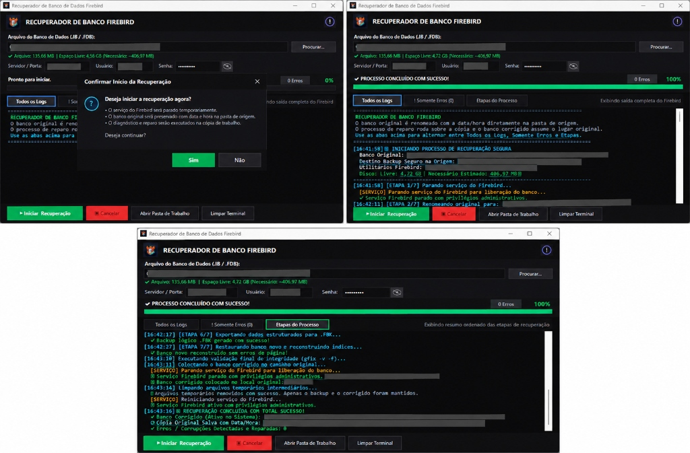
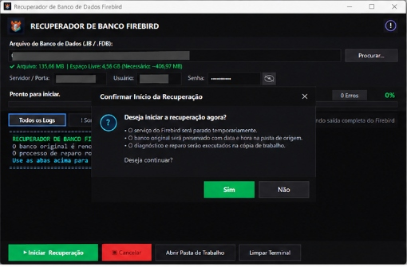
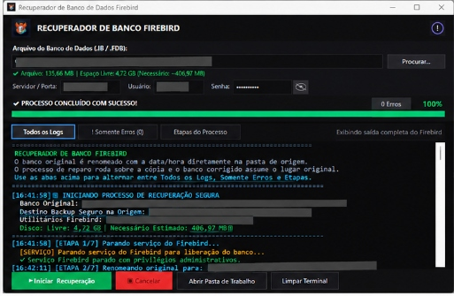
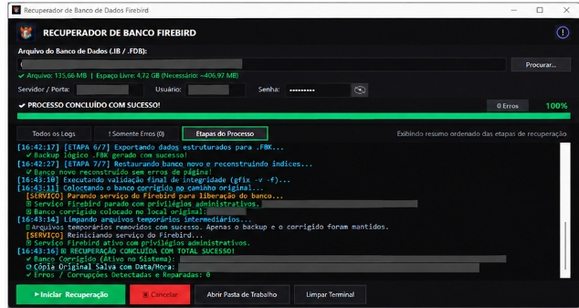
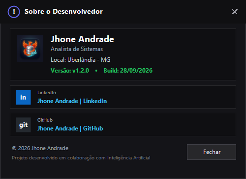
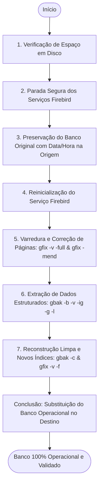

# 🛠️ Recuperador de Banco de Dados Firebird (RecupBD)

<p align="center">
  
</p>

<p align="center">
  <b>Solução desktop moderna, não destrutiva e com interface Dark Theme para diagnóstico, reparo físico de páginas corrompidas e reconstrução lógica de bancos de dados relacionais Firebird (.IB / .FDB / .GDB).</b>
</p>

<p align="center">
  <a href="https://microsoft.com/windows"></a>
  <a href="https://dotnet.microsoft.com/"></a>
  <a href="https://firebirdsql.org/"></a>
  
  <a href="LICENSE"></a>
</p>

---

## 📸 Demonstração Geral do Processo

Abaixo, a visualização completa do fluxo: a confirmação prévia com resumo de ações, o log em tempo real com barra de progresso em 100% e o resumo cronológico das 7 etapas concluídas com sucesso.

<p align="center">
  
</p>

---

## 🎯 Por que o RecupBD foi criado?

A rotina tradicional de recuperação de bancos Firebird corrompidos normalmente exige:
1. Abrir prompts de comando (`cmd`) manuais como Administrador.
2. Descobrir e parar serviços do Firebird no painel `services.msc`.
3. Exportar variáveis de ambiente sensíveis (`SET ISC_USER=...` e `SET ISC_PASSWORD=...`) expondo senhas em scripts ou histórico do shell.
4. Digitar comandos extensos e suscetíveis a erro com `gfix` e `gbak`.
5. Risco constante de sobrescrever ou danificar a base original caso um comando falhe no meio.

O **RecupBD** transforma todo esse procedimento arriscado em uma **operação automatizada de 1 clique**, com total isolamento do banco original e monitoramento visual em tempo real.

---

## ✨ Recursos e Galeria da Aplicação

### 1. 🖥️ Tela Principal Limpa e Segura
Inicia totalmente em branco na primeira execução. Permite arrastar o arquivo de banco para a janela ou selecionar via diálogo. Conta com botão de revelação de senha (olho vetorial), verificação dinâmica de espaço livre em disco e opção de persistência criptografada.

<p align="center">
  
</p>

---

### 2. 🛡️ Diálogo de Confirmação e Segurança Preventiva
Antes de tocar em qualquer serviço ou arquivo, o sistema valida se a unidade possui espaço suficiente (garantindo no mínimo o dobro do tamanho do banco) e abre uma caixa de diálogo nativa escura resumindo exatamente o que será feito.

<p align="center">
  
</p>

---

### 3. 📊 Terminal com Abas e Filtro Inteligente de Erros
Esqueça telas pretas indecifráveis. O terminal moderno possui três modos de visualização:
- **`Todos os Logs`**: Detalhamento técnico completo de todas as saídas do `gfix` e `gbak`.
- **`! Somente Erros (X)`**: Filtro dedicado que isola corrupções reais de páginas (`bad checksum`, `wrong page type`, etc.), descartando milhares de linhas normais de metadados.
- **`Etapas do Processo`**: Visão executiva das etapas concluídas com data e hora.

<p align="center">
  
</p>

---

### 4. ⚙️ Resumo Ordenado das Etapas Concluídas
Aba focada em auditoria rápida, documentando o horário exato da parada de serviços, salvamento do backup com data/hora, exportação lógica e substituição final bem-sucedida.

<p align="center">
  
</p>

---

### 5. 👨‍💻 Janela "Sobre o Desenvolvedor"
Acessível pelo botão `(!)` no cabeçalho superior direito. Apresenta informações da versão, build e botões diretos para perfis profissionais no LinkedIn e GitHub.

<p align="center">
  
</p>

---

## 🔄 Fluxo de Recuperação Não Destrutivo



---

## 🔐 Segurança e Privacidade

- **Criptografia Local de Credenciais**: Quando a opção *"Salvar dados neste computador"* está ativada, a senha é armazenada localmente com **AES-128-CBC** (`recupbd.cfg`). Nenhuma credencial trafega em texto puro.
- **Isolamento Total**: O banco original do cliente nunca sofre reparos diretos no mesmo arquivo. Ele é preservado com timestamp e todo o reparo acontece sobre uma cópia de trabalho em sandbox.
- **Zero Vazamentos no Repositório**: Arquivos de dados (`.IB`, `.FDB`, `.FBK`, `.GDB`), arquivos de configuração local (`.cfg`) e scripts legados estão estritamente bloqueados pelo `.gitignore`.

---

## 🚀 Como Executar

1. Baixe o executável [`RecupBD.exe`](RecupBD.exe) diretamente deste repositório (ou compile pelo código-fonte).
2. Execute como **Administrador** (necessário para gerenciar os serviços do Firebird no Windows).
3. Selecione o arquivo de banco de dados (`.IB` ou `.FDB`).
4. Informe o Usuário e a Senha (ou marque para salvar no computador).
5. Clique em **▶ Iniciar Recuperação**.

---

## 🔨 Como Compilar o Código Fonte

O projeto foi construído em **C#** puro sobre o **.NET Framework 4.0** nativo do Windows, sem necessidade de ferramentas pesadas de terceiros.

### Opção 1: Via Script `build.bat` (1 Clique)
Basta dar um duplo clique no arquivo [`build.bat`](build.bat) na raiz do projeto.

### Opção 2: Linha de Comando Direta (`csc.exe`)
Execute no Prompt de Comando do Windows:
```cmd
C:\Windows\Microsoft.NET\Framework64\v4.0.30319\csc.exe /nologo /codepage:65001 /target:winexe /win32icon:app_icon.ico /win32manifest:app.manifest /r:System.ServiceProcess.dll /out:RecupBD.exe RecupBD.cs
```

### Opção 3: Script Python com Ajuste de Idioma PE
```cmd
python build.py
```

---

## 💻 Requisitos do Sistema

- **Windows**: Windows 7 SP1, 8, 8.1, 10, 11 ou Windows Server 2008 R2+.
- **Firebird**: Versões 2.0, 2.1, 2.5, 3.0 ou 4.0.
- **Utilitários**: O programa busca `gbak.exe` e `gfix.exe` no Registro do Windows, nas pastas de instalação do Firebird ou na mesma pasta do executável.

---

## 📄 Licença

Este projeto está licenciado sob os termos da licença [MIT](LICENSE).

---

<p align="center">
  <b>Desenvolvido por Jhone Andrade</b><br/>
  <i>Uberlândia - MG • Analista de Sistemas</i><br/>
  <a href="https://br.linkedin.com/in/jhone-andrade-b450ab164">LinkedIn</a> • 
  <a href="https://github.com/jhoneandrade">GitHub</a>
</p>
