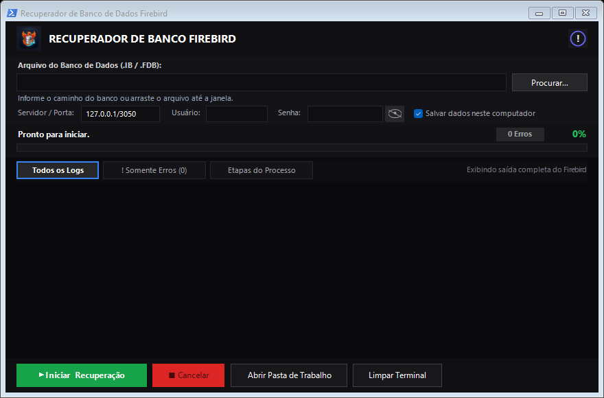
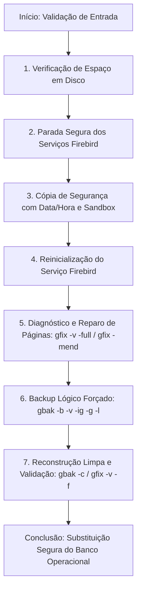

# 🛠️ Recuperador de Banco de Dados Firebird (RecupBD)

[](https://microsoft.com/windows)
[](https://dotnet.microsoft.com/)
[](https://firebirdsql.org/)
[]()
[](LICENSE)

Aplicação desktop moderna, não destrutiva e com interface Dark Theme desenvolvida para automação completa do processo de diagnóstico, correção de corrupções de páginas e restauração de integridade em bancos de dados relacionais **Firebird** (`.IB` / `.FDB` / `.GDB`).

---




## 🎯 Por que esta ferramenta existe?

A rotina manual de reparo de bancos Firebird corrompidos normalmente exige abrir prompts de comando (`cmd`), definir variáveis de ambiente (`ISC_USER`, `ISC_PASSWORD`), parar serviços manualmente no Windows (`services.msc`), rodar múltiplos comandos (`gfix -v -full`, `gfix -mend`, `gbak -b`, `gbak -c`) e cruzar os dedos torcendo para não sobrescrever o arquivo original do cliente.

O **RecupBD** transforma todo esse processo arriscado e complexo em **um único clique**, com salvaguardas rigorosas de integridade e feedback visual em tempo real.

---

## ✨ Principais Funcionalidades

- 🛡️ **Operação 100% Não Destrutiva**:
  - Antes de qualquer manipulação, o banco original é preservado com timestamp exato (`Ex: Banco_20260928_173000.IB.bak`).
  - O diagnóstico e o reparo operam em uma cópia isolada de trabalho. Se qualquer erro inesperado ocorrer, o banco original permanece intacto.

- 🔍 **Validação Automática de Espaço em Disco**:
  - Calcula antecipadamente o tamanho do banco e garante que a unidade possui pelo menos o dobro de espaço livre necessário para abrigar a cópia de segurança, o backup lógico intermediário (`.FBK`) e o banco final reconstruído.

- ⚙️ **Gerenciamento Seguro de Serviços**:
  - Detecta e para com segurança serviços ativos do Firebird (`FirebirdServer`, `FirebirdGuardian`, instâncias personalizadas).
  - Reinicia o serviço no momento exato em que as ferramentas `gfix` e `gbak` precisam da camada de serviço (`service_mgr`).

- 📊 **Terminal Escuro com Filtros Inteligentes**:
  - Interface rica em Dark Mode com abas dedicadas:
    - **Todos os Logs**: Saída completa detalhada do processo.
    - **! Somente Erros**: Isola falhas reais e alertas críticos, ignorando linhas normais de metadados (`gbak: restoring...`).
    - **Etapas do Processo**: Visão resumida passo a passo das 7 etapas da rotina.
  - Indicador de status, progresso percentual fluído e contador dinâmico de erros.

- 🔐 **Segurança e Privacidade Total**:
  - **Zero Credenciais Fixas**: Inicia 100% em branco por padrão. Nenhuma senha ou caminho é exposto no código ou compartilhado.
  - **Persistência Criptografada Opcional**: Opção de salvar configurações localmente neste computador (`recupbd.cfg`) usando criptografia **AES-128**, facilitando o dia a dia do operador sem abrir mão da segurança.

- 🚀 **Portabilidade e Facilidade de Execução**:
  - Compilado contra o **.NET Framework 4.0** nativo do Windows.
  - Executável independente: basta copiar e executar, sem necessidade de instalar runtimes externos adicionais.
  - Localização automática dos binários `gbak.exe` e `gfix.exe` no Registro do Windows, nas pastas de instalação do Firebird ou na pasta da aplicação.

---

## 🔄 Fluxo de Recuperação (7 Etapas)



---

## 💻 Como Compilar o Código Fonte

O projeto utiliza exclusivamente bibliotecas da BCL do Windows e WinForms, podendo ser compilado diretamente pelo compilador nativo do Windows sem necessitar do Visual Studio completo:

### Método 1: Via Script `build.bat` (Recomendado)
Basta dar duplo clique no arquivo `build.bat` ou executar via terminal:
```cmd
build.bat
```

### Método 2: Via Linha de Comando Nativa (`csc.exe`)
```cmd
C:\Windows\Microsoft.NET\Framework64\v4.0.30319\csc.exe /nologo /codepage:65001 /target:winexe /win32icon:app_icon.ico /win32manifest:app.manifest /r:System.ServiceProcess.dll /out:RecupBD.exe RecupBD.cs
```

---

## 📋 Pré-requisitos de Execução

- **Sistema Operacional**: Windows 7 SP1, Windows 8/8.1, Windows 10, Windows 11, Windows Server 2008 R2 ou superior.
- **Firebird**: Qualquer versão (Firebird 2.0, 2.1, 2.5, 3.0 ou 4.0) instalada no computador ou com os utilitários `gbak.exe` e `gfix.exe` disponibilizados junto ao executável.
- **Permissão de Administrador**: Necessária para pausar/iniciar serviços do Windows (solicitada automaticamente via manifesto UAC).

---

## 📄 Licença

Distribuído sob a licença **MIT**. Consulte o arquivo [`LICENSE`](LICENSE) para mais detalhes.

---

**Desenvolvido por Jhone Andrade**  
*Automação, robustez e segurança para suporte de banco de dados.*
